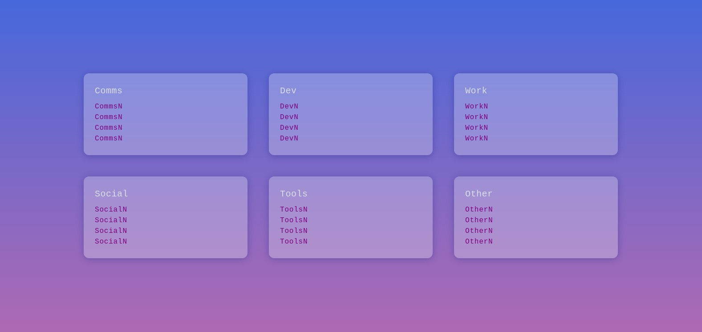

<h2 align='center'>startpage</h2>

<p align='center'>
  <b>A customizable start page for your browser.</b>
  <br><br>
  Built using Eleventy.
</p>

## Usage Instructions

1. Clone this repository to your local machine
2. `cd` into the cloned folder
3. Run `npm install`
4. `npm run serve` to get a local development server @ `localhost:8080`

When you're satisfied, use `npm run build` to build your start page into `./public/index.html`. This file can then be set as start page and/or custom "New Tab" page in your browser (see: [New Tab Changer](https://chrome.google.com/webstore/detail/new-tab-changer/occbjkhimchkolibngmcefpjlbknggfh/) for example).

### Customize Categories

Categories (cards; grid items) are defined in `./src/_data/categories.json`; their `name` property is used to categorize your links = display them in the corresponding section.

Note: **The order your categories are defined in also sets the order in which they are displayed.**

### Add Your Links

Links can be edited in `./src/_data/links.json`. They are defined as follows:

```json
{
  "category": "CategorName",
  "name": "LinkName",
  "url": "LinkURL"
}
```

The `category` key should correspond to one of the categories defined in your `categories.json` - links with wrong or missing `category` values will be ignored.

The order you define links in *does not matter*; links will also be sorted alphabetically by default.

If this A-Z sorting is not desired, simply change your `./src/index.njk` file from this:

```

```

To this:

```

```

Links will then follow the order they've been added in, based on your `links.json` file.

### Customize Styling

All CSS can be found in `./src/_includes/css.njk` and will be inlined into the generated `index.html`.

## Feedback

Please use discussions for that, thanks!